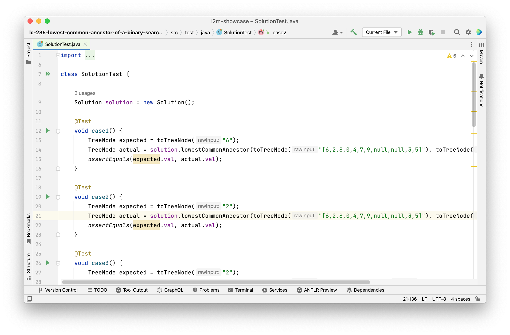
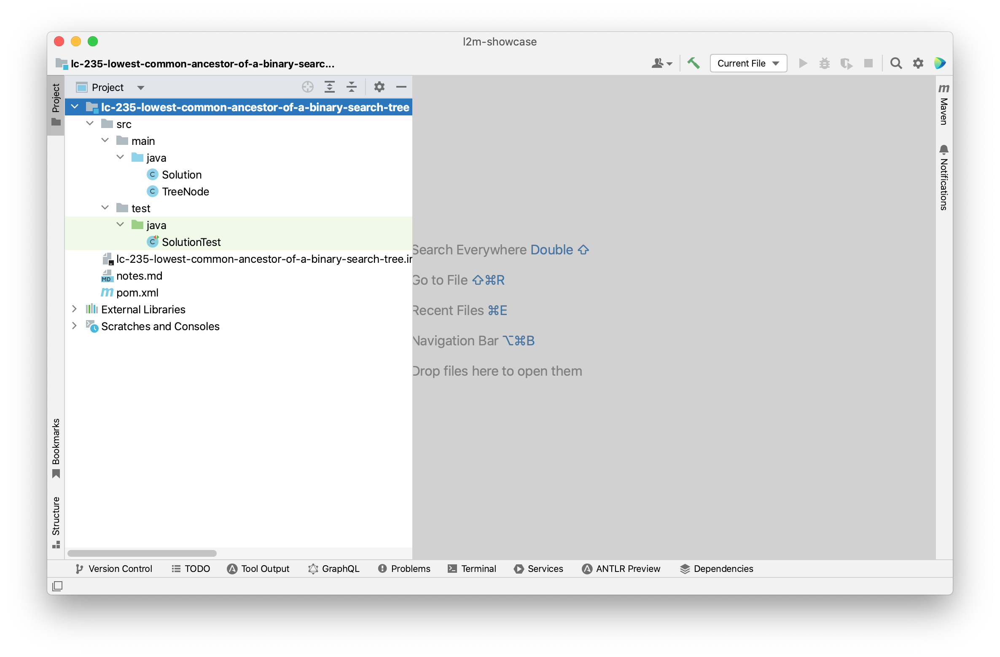
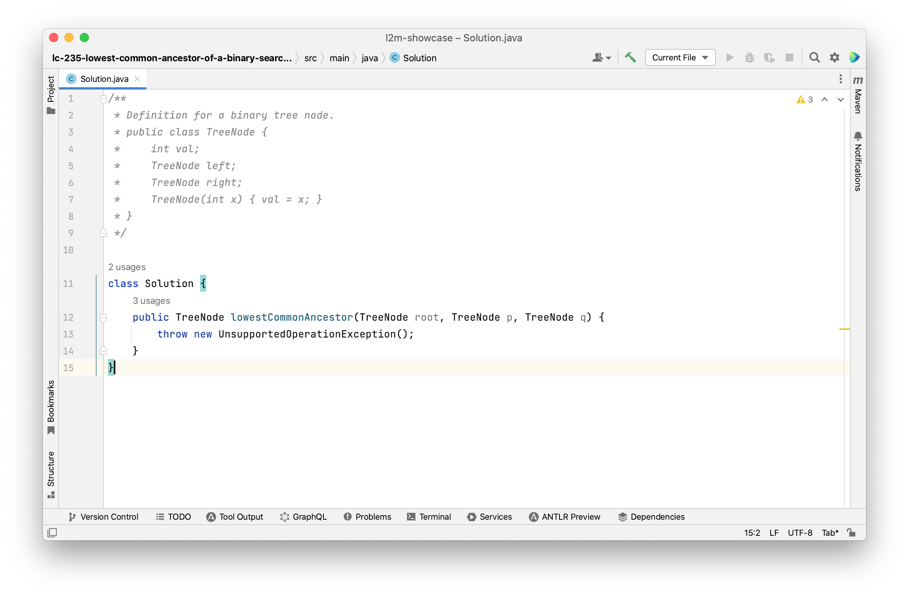
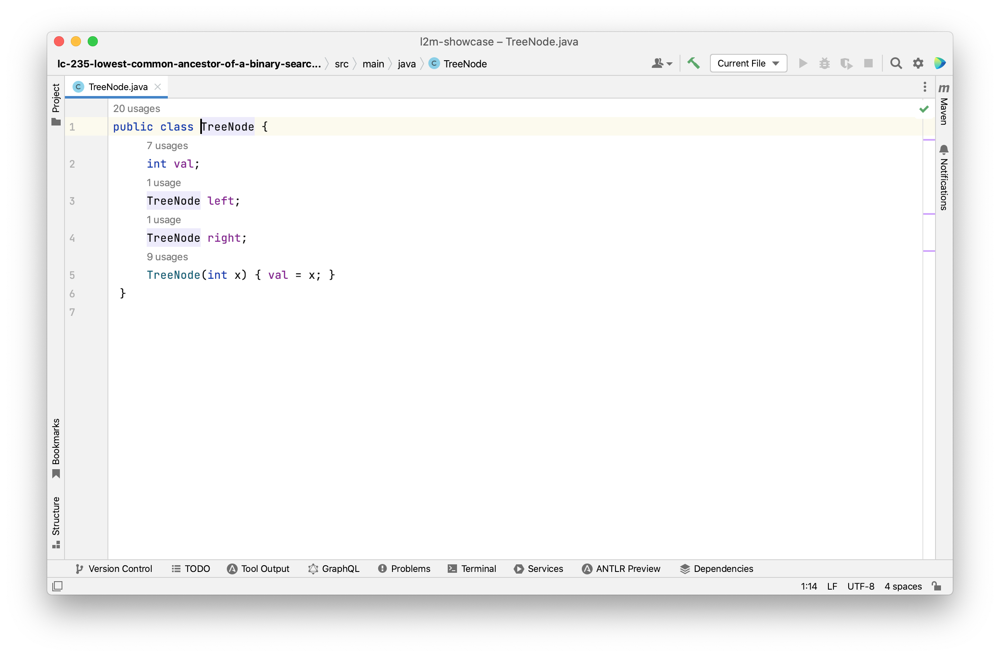

# leetcode-to-maven

A cli tool to generate a maven project from a leetcode question, so that you can code and test in your IDE.

Generated content include
* A compilable **Solution class**
* Supporting classes such as `TreeNode`
* **Assertion-based**, immediate-runnable **unit tests** filled with example test cases
* A **note** file for you to write down algorithm thoughts  

The project prides itself on the unit test code generation:  


<details>
    <summary>Click to see more screenshots</summary>
    
    
     
</details>

# Quick start

## Install

Clone or download this repo, then

```bash
./install.sh
```

for upgrading 
```bash
git pull  #or re-download this repo
./install.sh
```

## Use it

```bash
cd /path/to/your/workspace  # the parent dir of your maven projects
l2m 235 # 235 is the "questionFrontendId", which can be seen on leetcode website
```

Then you can import the project to your IDE
* In Intellij, you should create `Module from existing sources` and then pick the `pom.xml` file


## But I'm a Windows user

```bash
mvn clean install -DskipTests
cp target/leetcode-to-maven-shaded.jar /path/to/your/workspace
cd /path/to/your/workspace
java -jar /path/to/your/workspace 235
```

# More tips

## Why use this

* You can code and debug in your favourite IDE, without manual copy/paste
* You can put your code in a VCS such as git. This is especially important for `notes.md`
* You can use generated `test util methods` to convert leetcode's raw test data into Java types (See below) 

## Use `test util methods` to take leetcode's raw test data
Use `int[]` as an example.

Leetcode only provides you test data in a form like `[3,8,12,16]`, but what you need is `new int[]{3,8,12,16}` when writing a test case.

What you can do is to use the generated `toIntArray()` method which takes the raw data, such as 

```
    @Test
    void caseRandom() {
        int[] expected = toIntArray("[3,8,12,16]");
        int[] actual = runIt(); //...
        //...
    }
```

All these methods can be found at [here](src/main/resources/maven-project-template/src/test/java/UnitTest.java.ftl) (They will be automatically put in your unit test class, depending on the question's parameter types and return type).